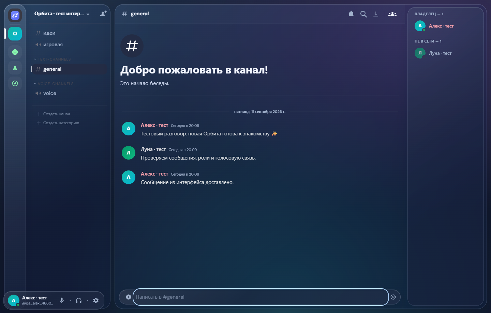

# Орбита Community

Самостоятельный сервис для общения: сообщества, каналы, переписка, профили, голос и демонстрация экрана. Клиент Windows на Electron.

## Скачать

[Скачать установщик Windows x64](https://github.com/e4172383-cyber/orbita-community/releases/latest/download/Orbita-Setup-2.0.1.exe)

[Все файлы релиза](https://github.com/e4172383-cyber/orbita-community/releases/latest) · [Открыть веб-версию](https://chat.orbita.195-201-169-74.sslip.io)

Запустите установщик, выберите папку и зарегистрируйте аккаунт. Клиент подключается к серверу Орбиты; интерфейс обновляется с сервера. Данные аккаунта и переписка сохраняются на сервере.

## Возможности

- Русский интерфейс, скруглённые стеклянные панели, SVG-преломление и анимации.
- Аккаунты с паролем, профили, сообщества, каналы, личные сообщения и вложения.
- Голос и видео через LiveKit.
- Демонстрация экрана: 480p, 720p, 1080p, 1440p; 16, 30, 60 FPS.
- Рекомендуемый режим демонстрации: 1080p / 30 FPS. Настройки доступны в голосовом канале через «Качество видео».

## Исходники и лицензии

Это репозиторий распространения. Полный соответствующий исходный код клиента и сервера с изменениями, лицензиями и сценарием развёртывания приложен к релизу как `Orbita-Community-Source.zip`.

Основа: [TheZwiss/backspace](https://github.com/TheZwiss/backspace), commit `275935c7f8bab9d7e4c84111dd8dfe092d9115d0`, AGPL-3.0-only. Эффект преломления адаптирован из [rdev/liquid-glass-react](https://github.com/rdev/liquid-glass-react), MIT, Copyright 2025 MAX ROVENSKY. Лицензии и авторство сохранены в архиве исходников. Это независимый проект, не официальный Discord.

## Проверка и ограничения

Проверены установка и удаление Windows-клиента, регистрация, переписка, сохранение авторизации после перезапуска, голос и видео между тестовыми клиентами. Проверены 12 сочетаний качества демонстрации, сохранение настроек и переключение кодировщика с 60 на 16 FPS в синтетической трансляции.

Фактическая частота кадров зависит от устройства и сети. Камера использует отдельный режим 720p30. Захват системного звука, глобальные горячие клавиши и определение игр не подключены. Установщик не подписан цифровой подписью.

## Обновления 2.0.1

Исправлены названия и обнаружение микрофонов. Кнопка «Обновления» на левой панели проверяет GitHub, скачивает установщик с проверкой SHA-512 и предлагает установку с перезапуском. При запуске и каждые 30 минут выполняется проверка версии. Переход с 2.0.0 требует одной обычной установки поверх.

В трансляциях доступны экономный, рекомендуемый и максимальный пресеты, а также быстрый переключатель RNNoise. RNNoise — бесплатное встроенное шумоподавление; Krisp SDK не включён и требует отдельной коммерческой лицензии.

## Обновления 2.0.2

История личных и групповых звонков с длительностью и кнопкой «Перезвонить», смена баннера профиля и исправление бокового чата звонка. Запись аудио и видео не ведётся.

## Обновления 2.0.3

Исправлена проверка GitHub. Звонок в ЛС сохраняется после выхода собеседника до 5 минут, можно вернуться в него. Лимит сообщений: 10 000, для подтверждённого аккаунта — 64 000 символов. Снижен битрейт демонстрации в зависимости от разрешения и FPS.

## Обновления 2.0.4

Новые собственные звуки, галочки в списках и чате, ручной битрейт и качественные пресеты демонстрации. Орбита +: выдача администратором и хранение срока на сервере; коммерческая оплата не подключена.

## Android и iPhone

[Android APK](https://github.com/e4172383-cyber/orbita-community/releases/download/v2.0.6/Orbita-Android-2.0.7.apk) · [Установка на iPhone](https://chat.orbita.195-201-169-74.sslip.io/mobile.html). Android 8+. Для iPhone — веб-приложение Safari на главном экране. Фоновые вызовы и отправка экрана телефона пока не поддерживаются.

Мобильное обновление 2.0.5: скачивание APK через браузер, уведомления и ручная проверка обновлений, звонки в ЛС и просмотр профиля. APK доступен среди файлов релиза 2.0.4; версия настольного приложения остаётся 2.0.4.

Версия 2.0.6: ПК работает в трее, входящие звонки с кнопками Ответить/Отклонить и системные уведомления. Android получил отдельную фоновую службу и настройки уведомлений; требуется разрешение уведомлений. Firebase/APNs, доставка после принудительной остановки и фоновые звонки iPhone пока не реализованы. Подробности и оба установщика — в релизе 2.0.6.

Android 2.0.7: обновлённый экран звонка и сокращённое ожидание обработки ответа из уведомления. В подключениях теперь карточка «Подходящая локация — Автоматически» без адреса сервера. Сейчас доступна одна локация; географического переключения нет.
Привилегии Орбита Плюс: сообщения до 64 000 символов, описание профиля до 2 000, личный статус до 256. Лимиты проверяются сервером по сроку подписки; после окончания существующие сообщения и профиль сохраняются. Доступно в веб-интерфейсе, ПК и Android без нового установщика.

## Орбита Шоп

Магазин украшений профиля за кристаллы: 28 рамок, примерка, подтверждение покупки, постоянный инвентарь, надеть/снять и история операций. Доступен в профиле телефона и настройках учётной записи на ПК. Кристаллы приобретаются вручную через администратора @fame_miks; платёжный шлюз не подключён. Админ-панель → Сервер → Пользователи → Кристаллы: начисление с причиной и журналом. Баланс и покупки сохраняются на сервере. Повторные запросы защищены от двойного начисления/списания. Для этого обновления новый установщик не требуется — перезапустите приложение.

Каталог исправлен: 28 полноценных анимированных рамок, включая 26 новых из [GitHub](https://github.com/Hayanaga/SillyTavern-AvatarDecorations-CSS). Смайлики убраны. Исходные цвета сохранены, доступны поиск, примерка и статичный вариант при отключённых анимациях. Старые покупки сохранены. У сторонней коллекции не указана лицензия на изображения; авторство и источники перечислены в NOTICE.md, изображения не покрываются лицензией кода Орбиты.
